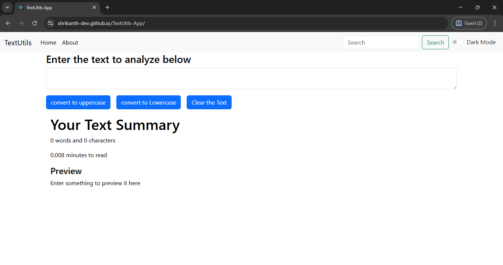

# TextUtils-App

## Table of Contents

- [Overview](#overview)
  - [The Challenge](#the-challenge)
  - [Screenshot](#screenshot)
  - [Links](#links)
  - [Built With](#built-with)
- [Available Scripts](#available-scripts)
- [Learn More](#learn-more)
- [Author](#author)

---

## Overview

TextUtils-App is a simple React application that allows users to manipulate and analyze text, including word counting, character counting, and other utilities for text management. It is designed to demonstrate React fundamentals while providing a practical, usable tool.

### The Challenge

To build a clean, functional React application for practicing React fundamentals, deploying to GitHub Pages, and applying routing and component structuring effectively.

### Screenshot

### Links

- Live Site: [TextUtils-App Live](https://shrikanth-dev.github.io/TextUtils-App/)
- Repository: [GitHub Repo](https://github.com/shrikanth-dev/TextUtils-App)

### Built With

- React
- JavaScript (ES6+)
- Create React App
- React Router DOM
- GitHub Pages Deployment

---

## Available Scripts

In the project directory, you can run:

### `npm start`

Runs the app in development mode.\
Open [http://localhost:3000](http://localhost:3000) to view it in your browser.

The page will reload on changes, and you may see lint errors in the console.

### `npm test`

Launches the test runner in interactive watch mode.\
See [running tests](https://facebook.github.io/create-react-app/docs/running-tests) for details.

### `npm run build`

Builds the app for production to the `build` folder, optimizing for best performance.\
See [deployment](https://facebook.github.io/create-react-app/docs/deployment) for more.

### `npm run eject`

Note: This is a one-way operation. Once you `eject`, you can't go back!

It copies all configurations and dependencies (webpack, Babel, ESLint, etc.) into your project, allowing full control over them.

---

## Learn More

- [Create React App Documentation](https://facebook.github.io/create-react-app/docs/getting-started)
- [React Documentation](https://reactjs.org/)
- [Code Splitting](https://facebook.github.io/create-react-app/docs/code-splitting)
- [Analyzing Bundle Size](https://facebook.github.io/create-react-app/docs/analyzing-the-bundle-size)
- [Making a Progressive Web App](https://facebook.github.io/create-react-app/docs/making-a-progressive-web-app)
- [Advanced Configuration](https://facebook.github.io/create-react-app/docs/advanced-configuration)
- [Troubleshooting `npm run build` Minify Issues](https://facebook.github.io/create-react-app/docs/troubleshooting#npm-run-build-fails-to-minify)

---

## Author

- Shrikanth Dev
- [GitHub](https://github.com/shrikanth-dev)
- LinkedIn - [@G Srikanth](https://www.linkedin.com/in/g-srikanth-gs)
